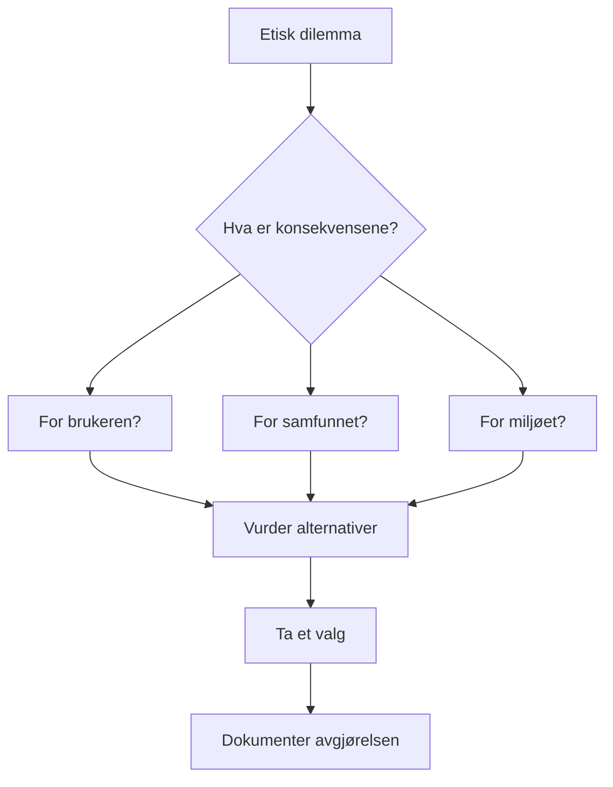

# Regelverk og etisk refleksjon

## 🎯 Hva skal du lære?

Du skal anvende regelverk for bruk og formidling av innhold i egen produksjon og reflektere over ansvar og etikk knyttet til teknologiutvikling.

## 📘 Fagstoff

### Hvilke regler gjelder når du lager noe?

Når du utvikler en app, en nettside eller et spill, er det flere lover og regler du må forholde deg til. De viktigste er:

| Regelverk | Hva handler det om? |
|-----------|---------------------|
| **Åndsverkloven** | Beskytter kreative verk — du kan ikke kopiere andres arbeid uten tillatelse |
| **Personvernforordningen (GDPR)** | Regler for innsamling og behandling av personopplysninger |
| **Markedsføringsloven** | Regler for reklame og markedsføring |
| **Forbrukerkjøpsloven** | Dine rettigheter og plikter som leverandør |

### Opphavsrett og åndsverkloven

Opphavsrett oppstår automatisk når du skaper noe — en tekst, et bilde, en kode, en video. Du trenger ikke å registrere den noe sted.

**Hva er beskyttet?**
- Tekster (bøker, artikler, kode)
- Bilder og illustrasjoner
- Musikk og lydopptak
- Film og video
- Dataprogrammer (kildekode)

**Hvor lenge varer opphavsretten?**
- 70 år etter opphavspersonens død

**Siteringsretten:** Du kan sitere korte utdrag fra andres verk, så lenge du oppgir kilde. Dette gjelder også kode — du kan bruke andres kode som inspirasjon, men ikke kopiere den direkte uten lisens.

```python
# Eksempel: SITERING AV KODE — du kan bruke andres kode som inspirasjon
# Original: https://github.com/bruker/prosjekt (MIT-lisens)
def hils_bruker(navn):
    """Hils på brukeren — inspirert av eksempel fra MIT-lisensert prosjekt"""
    return f"Hei, {navn}! Velkommen til appen vår."
```

### Creative Commons og åpne lisenser

Når du deler arbeidet ditt, kan du bruke CC-lisenser for å bestemme hvordan andre kan bruke det:

| Lisens | Betyr | Kan brukes kommersielt? |
|--------|-------|------------------------|
| **CC0** | Ingen rettigheter forbeholdt — fritt bruk | Ja |
| **CC BY** | Krediter opphavspersonen | Ja |
| **CC BY-SA** | Krediter + del på samme vilkår | Ja |
| **CC BY-NC** | Krediter + kun ikke-kommersielt | Nei |
| **CC BY-NC-SA** | Krediter + kun ikke-kommersielt + del på samme vilkår | Nei |

**I kodeverdenen:** Open source-lisenser som MIT, GPL og Apache fungerer på samme måte. MIT sier "gjør hva du vil, bare ikke klandre meg", mens GPL krever at du deler koden din på samme vilkår.

### Etiske dilemmaer i teknologibransjen

Som utvikler møter du på etiske valg hver dag. Her er noen vanlige dilemmaer:

- **Personvern:** Er det greit å samle inn brukerdata for å tjene penger?
- **Algoritmisk skjevhet:** AI som diskriminerer basert på kjønn eller etnisitet
- **Mørke mønstre:** Design som lurer brukeren til å gjøre noe de ikke vil
- **Bærekraft:** Energibruk, e-avfall, planlagt foreldelse
- **Tilgjengelighet:** Lager du løsninger som alle kan bruke?



### Kunstig intelligens og etikk

KI gir nye etiske utfordringer:
- **Skjevheter:** KI-modeller trenes på data som kan inneholde fordommer
- **Gjennomsiktighet:** Bør vi vite når vi snakker med en chatbot?
- **Opphavsrett:** Hvem eier det KI-genererte innholdet?
- **Arbeidsplasser:** Hvilke jobber forsvinner, hvilke kommer?
- **Ansvarlighet:** Hvem har ansvaret når en KI tar feil?

## 💡 Praktiske eksempler

**Velg riktig lisens for prosjektet ditt:**
Du har laget en kul app for å organisere lekser. Du vil dele den på GitHub, men du vil ikke at noen skal tjene penger på koden din. Hvilken lisens velger du? → CC BY-NC eller en custom open source-lisens.

**Etisk dilemma — diskuter i klassen:**
Du utvikler en spill-app for barn. Sjefen din ber deg legge til "mørke mønstre" som gjør at barn lettere klikker på reklame. Hva gjør du?

## 🔗 Tverrfaglige koblinger

- **Teknologiforståelse:** Personvern, GDPR i praksis
- **Produksjon og historiefortelling:** Kildekritikk, opphavsrett i egne produksjoner
- **Samfunnsfag:** Demokrati, ytringsfrihet, personvern i samfunnet

## 🛠️ Prøv selv!

1. **Lisens-sjekk:** Gå inn på GitHub og finn et prosjekt du liker. Les LICENSE-fila. Hvilken lisens har det? Hva kan du og ikke kan du gjøre med koden?
2. **Personvurdering:** Se på personvernerklæringen til en app du bruker daglig (f.eks. Snapchat, TikTok). Hvilke data samler de inn? Hvor lenge lagrer de dem?
3. **Etisk refleksjon:** Lag en liste over 3 etiske dilemmaer du kan møte som IT-utvikler. For hvert dilemma: hva ville du gjort, og hvorfor?

## 📋 Nøkkelbegreper

- **Opphavsrett** — automatisk rettighet til det du skaper
- **GDPR** — personvernforordning i EU/EØS
- **CC-lisens** — standardisert måte å dele verk lovlig
- **Open source** — kode som er fritt tilgjengelig
- **Mørke mønstre** — design som lurer brukere
- **Algoritmisk skjevhet** — KI som diskriminerer

## 📚 Kilder

- NDLA — Regelverk og etisk refleksjon
- [Datatilsynet — Personvern](https://www.datatilsynet.no/)
- [GDPR-forordningen (Lovdata)](https://lovdata.no/NL/lov/2018-06-15-38)
- [Creative Commons — Om lisenser](https://creativecommons.org/)
- [Etisk teknologi — Teknologirådet](https://teknologiradet.no/)
