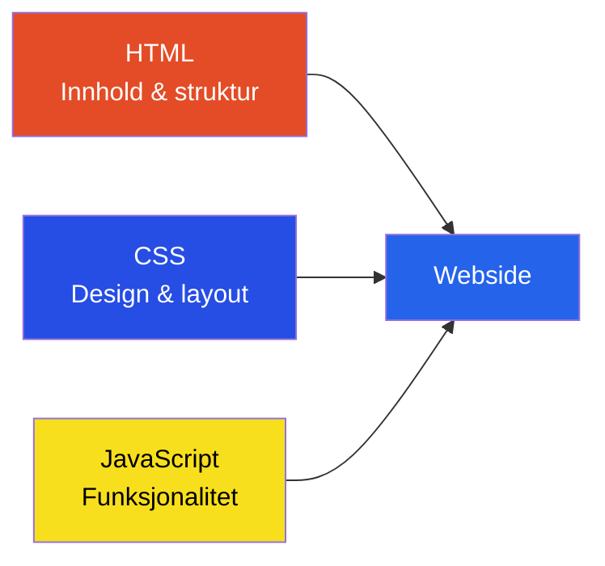

# Webutvikling — HTML, CSS og publisering

## 🎯 Hva skal du lære?

Du skal bruke oppmerkingsspråk (HTML) og stilsett (CSS) i ulike produksjoner, samt visualisere og utvikle konsepter tilpasset ulike plattformer.

---

## 📘 Fagstoff

### Hva er webutvikling?

Webutvikling handler om å lage nettsider og webapplikasjoner. Du jobber med tre hovedteknologier som samspiller:



- **HTML:** Innhold og struktur (overskrifter, tekst, bilder, linker)
- **CSS:** Design og layout (farger, fonter, plassering)
- **JavaScript:** Funksjonalitet (animasjoner, interaktivitet)

### HTML-grunnleggende

```html
<!DOCTYPE html>
<html lang="nb">
<head>
  <meta charset="UTF-8" />
  <title>Min første nettside</title>
</head>
<body>
  <h1>Velkommen!</h1>
  <p>Dette er min første nettside.</p>
  
  <a href="https://ndla.no">Besøk NDLA</a>
</body>
</html>
```

**Vanlige HTML-tagger:** `<h1>`–`<h6>` (overskrifter), `<p>` (avsnitt), `` (bilde), `<a>` (lenke), `<div>` (boks), `<ul>`/`<li>` (punktliste)

### CSS-grunnleggende

```css
body {
  font-family: Arial, sans-serif;
  background-color: #f0f0f0;
  color: #333;
}

h1 {
  color: #2563eb;
  font-size: 32px;
  text-align: center;
}
```

**CSS-selektorer:**
- `element` — alle `<p>`-tagger
- `.klasse` — alle med class="klasse"
- `#id` — elementet med id="id"

### Universell utforming (UU)

Nettsider skal fungere for alle, uavhengig av funksjonsevne:
- **Kontrast:** God kontrast mellom tekst og bakgrunn
- **Alternativ tekst:** `alt`-tekst på bilder for synshemmede
- **Tastaturnavigering:** All funksjonalitet skal kunne brukes uten mus
- **Skjermleser:** Skjermlesere leser opp innhold for blinde

---

## 💡 Praktiske eksempler

**Lag en enkel minneside:**
```html
<style>
  body { background: #f8f8fa; padding: 40px; }
  .kort { background: white; padding: 20px; border-radius: 10px; max-width: 400px; margin: 0 auto; }
  h1 { color: #2563eb; }
</style>
<div class="kort">
  <h1>Hei, jeg heter Ola!</h1>
  <p>Jeg går på VG1 IM og lærer webutvikling.</p>
</div>
```

---

## 🔗 Tverrfaglige koblinger

- **Produksjon og historiefortelling:** Design, layout, komposisjon, målgruppe
- **Teknologiforståelse:** Nettverk, DNS, publisering av nettsider

---

## 📚 Kilder

- NDLA — Konseptutvikling og programmering: Webutvikling
- [HTML og CSS (NDLA)](https://ndla.no/f/konseptutvikling-og-programmering-im-ikm-vg1/7bc23d06d79d)
