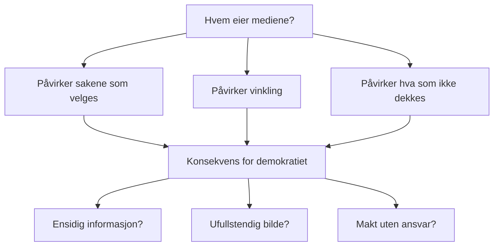

# Medier, makt og samfunn

## 🎯 Hva skal du lære?

Du skal utforske og tilegne deg kunnskap om endringer innenfor teknologi og programvare, gjøre rede for hvordan medier kan påvirke meningene våre, og forstå hvordan teknologi og sikkerhet påvirker åpne og demokratiske prosesser.

---

## 📘 Fagstoff

### Hvem eier mediene — og hvorfor betyr det noe?

Medieeierskap i Norge er konsentrert på få hender. Schibsted, Amedia og Norsk rikskringkasting kontrollerer mesteparten av norske medier. Dette påvirker hvilke saker som blir dekket og hvordan de blir vinklet.

### Teknologiendringer — hvordan har mediene utviklet seg?

| Tidsperiode | Medieform | Hvem bestemte innholdet? |
|-------------|-----------|------------------------|
| 1900–1960 | Avis, radio | Redaktører, statsautoriserte kringkastere |
| 1960–1990 | Fjernsyn, ukeblader | Redaktører, reklamefinansierte |
| 1990–2010 | Internett, blogger | Alle kan publisere, men portvakter finnes |
| 2010–2020 | Sosiale medier, strømming | Algoritmer bestemmer hva du ser |
| 2020– | KI-generert innhold, plattformer | Algoritmer + kunstig intelligens |

**Overgangen fra få-til-mange til mange-til-mange:** Før kunne bare journalister og forleggere publisere innhold. I dag kan alle med en smarttelefon nå ut til tusenvis. Det er bra for ytringsfriheten, men gjør det vanskeligere å skille pålitelig informasjon fra desinformasjon.

### Hvordan påvirker medier meningene våre?

Medier påvirker oss på tre nivåer:

1. **Hva vi tenker PÅ** — mediene setter dagsorden (agenda-setting)
2. **Hva vi tenker** — vinkling og framing påvirker holdninger
3. **Hva vi GJØR** — mobilisering, kjøp, politisk handling

**Filterbobler og ekkokamre:** Algoritmer på sosiale medier viser deg innhold du sannsynligvis vil like eller engasjere deg i. Over tid fører dette til at du bare ser meninger som ligner dine egne. Du havner i en informasjonsboble.

### Desinformasjon og falske nyheter

Desinformasjon er bevisst spredning av falsk informasjon. Det kan være alt fra satire til målrettet propaganda. KI har gjort det mye lettere å lage overbevisende falskt innhold:

- **Deepfakes:** Video/lyd som er manipulert med KI
- **AI-genererte artikler:** Tekster som ser ut som nyheter men er rent oppspinn
- **Botnettverk:** Automatiserte kontoer som sprer budskap

**Hvordan oppdage desinformasjon:**
- Sjekk avsender — er det en etablert nyhetskilde?
- Kan du finne samme sak hos andre medier?
- Virker overskriften overdrevet eller følelsesladet?
- Når ble saken publisert?

### Teknologi, sikkerhet og demokrati

Teknologi påvirker demokratiet på flere måter:

- **Valgpåvirkning:** Utenlandske aktører kan påvirke valg gjennon sosiale medier (f.eks. Facebook-Cambridge Analytica-skandalen)
- **Overvåking:** Myndigheter kan overvåke innbyggere i stor skala
- **Press mot pressefrihet:** Journalister blir hacket, overvåket eller truet
- **Digital infrastruktur:** Angrep på strømnett, sykehus eller valgsystemer kan lamme samfunnet

> **Visste du?** I 2024 ble flere norske kommuner rammet av dataangrep. Flere hadde ikke papirbackup og måtte gå uker uten digitale tjenester.

---

## 💡 Praktiske eksempler

**Sammenlign to mediers dekning:**
Finn den samme nyhetssaken hos to ulike medier (f.eks. VG og NRK). Sammenlign:
- Overskriften — er den ulik?
- Hvilke sitater er brukt?
- Hva er utelatt?
- Hvem kommer til orde?

**Sjekk algoritmen din:**
1. Gå inn på TikTok "For You"-siden
2. Scroll i 2 minutter
3. Hva slags innhold dukker opp?
4. Hvorfor tror du algoritmen viser deg akkurat dette?

---

## 🔗 Tverrfaglige koblinger

- **Teknologiforståelse:** Algoritmer, filterbobler, KI-sikkerhet
- **Konseptutvikling og programmering:** Hvordan algoritmer programmeres, datahåndtering
- **Samfunnsfag:** Demokrati, ytringsfrihet, maktfordeling

---

## 🛠️ Prøv selv!

1. **Medieanalyse:** Velg ut én nyhetssak. Finn den hos tre ulike medier. Notér forskjeller i overskrift, vinkling og hva som er inkludert/utelatt. Presenter for klassen.
2. **Desinformasjons-jakt:** Søk opp "desinformasjon [aktuelt tema]" på faktisk.no eller faktasjekk.no. Hvilke myter blir avkreftet?
3. **Filterboble-eksperiment:** Bruk én dag på å bevisst søke opp informasjon du er uenig i eller ikke kjenner til på sosiale medier. Merker du forskjell i hva som dukker opp i feeden din etterpå?

## 📋 Nøkkelbegreper

- **Agenda-setting** — medienes makt til å bestemme hva vi snakker om
- **Desinformasjon** — bevisst spredning av falsk informasjon
- **Filterboble** — algoritmisk begrenset informasjonsflyt
- **Deepfake** — KI-manipulert video/lyd
- **Ekkokammer** — miljø der du bare møter egne meninger

---

## 📚 Kilder

- NDLA — Medier, makt og samfunn
- [Medietilsynet](https://www.medietilsynet.no/) — Barn og medier, mediebildet
- [Faktisk.no](https://www.faktisk.no/) — Faktasjekk av norske påstander
- [SSB — Norsk mediebarometer](https://www.ssb.no/kultur-og-fritid/medier)
- [NorSIS — Sikker digital hverdag](https://norsis.no/)
