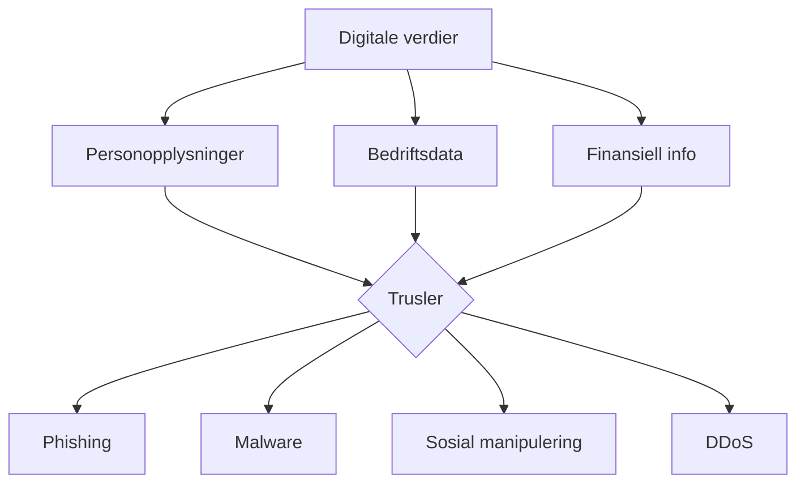
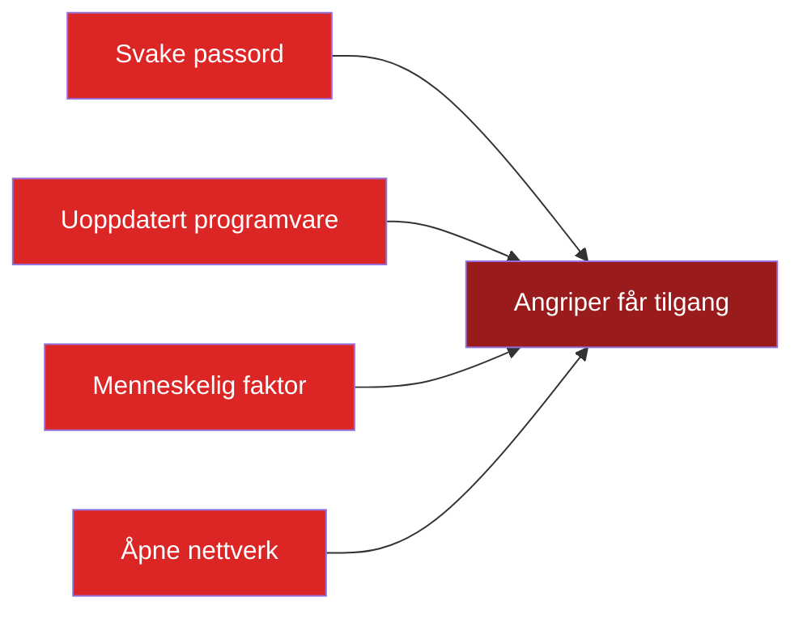

# Datasikkerhet — Trusler, sårbarheter og beskyttelse

## 🎯 Hva skal du lære?

Du skal utforske og beskrive digitale trusler, verdier og sårbarheter i samfunnet. Du skal også vurdere, anbefale og kvalitetssikre tiltak som reduserer risiko for uønsket spredning av data.

---

## 📘 Fagstoff

### Hvorfor er datasikkerhet viktig?

Vi lagrer mer og mer av livene våre digitalt: bankinformasjon, bilder, passord, helsedata, jobbmail. Samtidig blir angripere stadig mer avanserte. God sikkerhet handler ikke om å være 100% trygg — det finnes ikke — men om å redusere risiko til et akseptabelt nivå.

### De vanligste digitale truslene

| Trussel | Hvordan virker det? | Eksempel |
|---------|---------------------|----------|
| **Phishing** | Falske e-poster/SMS som etterligner ekte avsendere | "Din bank har oppdaget mistenkelig aktivitet — klikk her" |
| **Malware** | Skadelig programvare (virus, trojanere, ransomware) | Du laster ned et "gratis" program som egentlig stjeler passord |
| **Ransomware** | Krypterer filene dine og krever løsepenger | Sykehus har måttet stenge ned etter angrep |
| **Sosial manipulering** | Angriperen utgir seg for å være en du stoler på | "Hei, jeg er fra IT-support — jeg trenger passordet ditt" |
| **DDoS** | Overbelastningsangrep som tar ned nettsteder | Nettbutikk mister millioner i omsetning under Black Week |
| **Man-in-the-Middle** | Avlytting av kommunikasjon | Offentlig WiFi på kafé som fanges opp |
| **Nullpunktsangrep** | Angrep på nyoppdagede sikkerhetshull før de er lappet | Microsoft/Kaspersky/Zoom har hatt flere |

### Hva er mest verdt å beskytte?

Ikke alt er like verdifullt for en angriper. En risikovurdering hjelper deg å prioritere:

1. **Personopplysninger** — navn, adresse, fødselsnummer, passord
2. **Bedriftsdata** — kundelister, forretningshemmeligheter, strategier
3. **Finansiell informasjon** — bankkonto, kredittkort, kryptovaluta
4. **Immaterielle verdier** — opphavsrett, patenter, kildekode
5. **Tilgang** — en angriper vil ofte ha tilgang til systemet, ikke bare data

### Sårbarheter — hvor er svakhetene?

### Tiltak — hvordan beskytte seg

1. **Sikre passord:** Langt, unikt per tjeneste. Bruk passordmanager (LastPass, Bitwarden, Apple Keychain)
2. **Tofaktorautentisering (2FA/MFA):** Passord + kode på mobil — stopper 99,9% av automatiserte angrep
3. **Kryptering:** Gjør data uleselig for uvedkommende. End-to-end-kryptering i Messenger/WhatsApp
4. **Backup:** 3-2-1-regelen — 3 kopier, 2 ulike medier, 1 utenfor huset
5. **Oppdateringer:** Hold programvare og OS oppdatert — de fleste angrep utnytter kjente sårbarheter
6. **Brannmur:** Blokkerer uønsket trafikk
7. **Antivirus:** Oppdager og fjerner skadelig programvare

### Kvalitetssikring av sikkerhetstiltak

For å vite om tiltakene fungerer, må du teste dem:

- **Risikovurdering:** Identifiser trusler → vurder sannsynlighet og konsekvens → foreslå tiltak
- **Penetrasjonstesting:** Prøve å bryte seg inn for å avdekke svakheter — etisk hacking
- **Sikkerhetsrevisjon:** Gjennomgang av sikkerhetsrutiner og policy

---

## 💡 Praktiske eksempler

**3-2-1-regelen for backup:**
- **3** kopier av dataen din
- **2** ulike medier (f.eks. ekstern disk + skytjeneste som OneDrive/iCloud)
- **1** kopi et annet sted (brannsikkert / hos familie)

**Gjenkjenne phishing — 4 tegn:**
1. Avsenderadressen stemmer ikke (`noreply@nettbank-verify.com` i stedet for `@dnb.no`)
2. Haster og truende språk — "kontoen din blir stengt!"
3. Lenken fører til en falsk side — hold musepekeren over for å se den virkelige adressen
4. Ber om passord eller personopplysninger — ekte bedrifter gjør ALDRI dette

**To-faktor-autentisering i praksis:**
Du logger inn på skolemailen med passord. Deretter får du en kode på SMS eller i en app (Google Authenticator, Microsoft Authenticator). Uten den koden kommer du ikke inn — selv om noen har passordet ditt.

---

## 🔗 Tverrfaglige koblinger

- **Konseptutvikling og programmering:** Sikker koding (input-validering, SQL-injection prevention)
- **Produksjon og historiefortelling:** Etisk refleksjon rundt mediepåvirkning og sikkerhet

---

## 🛠️ Prøv selv!

1. **Phishing-test:** Gå til [Google Phishing Quiz](https://phishingquiz.withgoogle.com/) (eller søk opp "phishing test" og prøv en). Hvor mange klarte du?
2. **Sikkerhets-sjekk:** Sjekk passordene dine på [haveibeenpwned.com](https://haveibeenpwned.com/). Har noen av tjenestene du bruker hatt datalekkasjer?
3. **Slå på 2FA:** Gå inn i Instillinger → Sikkerhet på en av tjenestene du bruker (Google, Microsoft, Snapchat, TikTok). Slå på tofaktorautentisering hvis du ikke allerede har det.

## 📋 Nøkkelbegreper

- **Phishing** — falske meldinger som prøver å lure deg
- **Ransomware** — løsepengevirus som krypterer filer
- **2FA/MFA** — tofaktorautentisering
- **Kryptering** — gjør data uleselig uten nøkkel
- **Sosial manipulering** — utnytter menneskers tillit

---

## 📚 Kilder

- NDLA — [Datasikkerhet](https://ndla.no/e/teknologiforstaelse-im-ikm-vg1/datasikkerhet/6f3070fa20)
- [Norsk Sikkerhetsmyndighet (NSM)](https://nsm.no/) — Grunnprinsipper for IKT-sikkerhet
- [Sikker digital hverdag (NorSIS)](https://norsis.no/) — Råd til deg og bedriften
- [Have I Been Pwned](https://haveibeenpwned.com/) — Sjekk om din e-post er lekket
