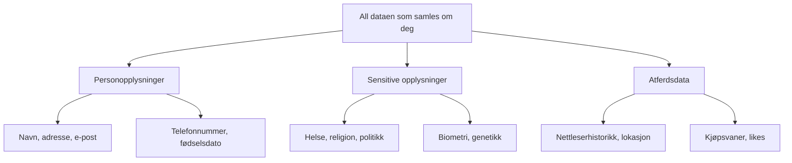

# Personvern og regelverk

## 🎯 Hva skal du lære?

Du skal gjøre rede for hvordan man behandler informasjon og personopplysninger i tråd med gjeldende regelverk. Du skal også vurdere tiltak som reduserer risiko for uønsket spredning av data.

---

## 📘 Fagstoff

### Hva er personvern — og hvorfor bryr vi oss?

Personvern handler om retten til privatliv og kontroll over egne personopplysninger. I en digital verden samles det inn enorme mengder data om oss — og vi må vite hvilke rettigheter vi har.

Facebook vet hvem vennene dine er. Google vet hva du søker på. TikTok vet hva du ser på. Banken vet hva du bruker penger på. Teleoperatøren vet hvor du beveger deg. Til sammen utgjør dette et detaljert bilde av livet ditt.

### De tre typene personopplysninger

| Type | Eksempler | Ekstra beskyttet? |
|------|-----------|-------------------|
| **Generelle** | Navn, adresse, e-post, telefon | Nei |
| **Sensitive** | Helse, religion, politisk syn, etnisitet, biometri | **Ja — ekstra strenge regler** |
| **Atferdsdata** | Nettleserhistorikk, kjøpsvaner, lokasjonsdata | Delvis — krever samtykke |

### GDPR — personvernforordningen

GDPR (General Data Protection Regulation) trådte i kraft i hele EU/EØS i 2018. Det er den strengeste personvernloven i verden, og den gir deg som innbygger sterke rettigheter.

**Dine rettigheter:**
- **Rett til innsyn:** Du kan be om å se hvilke data en bedrift har om deg
- **Rett til sletting:** "Retten til å bli glemt" — bedrifter må slette data om deg på forespørsel
- **Rett til dataportabilitet:** Du kan få dataene dine i et vanlig format (JSON/CSV)
- **Rett til å protestere:** Du kan motsette deg at dataene dine brukes til profilering
- **Samtykke:** Bedrifter må ha ditt aktive samtykke for å lagre og behandle data om deg — du kan ikke "tvinges" til å akseptere
- **Meldeplikt:** Databrudd må meldes til Datatilsynet innen 72 timer

**Krav til virksomheter som behandler personopplysninger:**
- Behandle personopplysninger lovlig, rettferdig og åpent
- Samle inn **kun** det som er nødvendig (dataminimering)
- Lagre data sikkert (kryptering, tilgangskontroll)
- Slette data når formålet er oppfylt
- Dokumentere alt (behandlingsgrunnlag, risikovurderinger)

### Åndsverkloven og opphavsrett

Personvern handler ikke bare om data — det handler også om rettighetene til det du skaper:

- **Opphavsrett:** Den som skaper et verk (tekst, bilde, musikk, kode) har automatisk rettighetene
- **Creative Commons (CC-lisenser):** Gjør det enklere å dele lovlig
  - **CC0:** Fritt bruk — ingen restriksjoner
  - **CC BY:** Krediter opphavspersonen
  - **CC BY-SA:** Krediter + del på samme vilkår
  - **CC BY-NC:** Kun ikke-kommersiell bruk

> ⚠️ **Husk:** Å laste ned et bilde fra Google Bildesøk og bruke det på nettsiden din er brudd på opphavsretten — med mindre bildet har en CC-lisens eller du har tillatelse.

---

## 💡 Praktiske eksempler

**Personvern-sjekk av en nettside:**
1. Se etter personvernerklæring (finnes nesten alltid nederst på siden)
2. Sjekk hvilke data som samles inn (cookies, analyseverktøy som Google Analytics)
3. Vurder om samtykket er frivillig og informert
4. Kan du takke nei til cookies uten å miste tilgang?

**Risikovurdering av dataspredning:**
1. Identifiser hvilke data som finnes i systemet
2. Hvem har tilgang? (ansatte, administratorer, tredjeparter?)
3. Hva kan gå galt? (lekkasje, tyveri, feilsending, insider)
4. Tiltak: Kryptering, tilgangskontroll, opplæring, logging

---

## 🔗 Tverrfaglige koblinger

- **Produksjon:** CC-lisenser, opphavsrett og kildebruk i egne produksjoner
- **Programmering:** Personvern ved innsamling av brukerdata i apper (GDPR-samtykke)

---

## 🛠️ Prøv selv!

1. **Be om innsyn:** Send en e-post til en tjeneste du bruker (Spotify, Snapchat, skoleplattform) og be om å få se hvilke data de har lagret om deg. De har 30 dager på å svare — gratis!
2. **Cookie-sjekk:** Gå inn på 3 ulike nettsider. Les cookie-varslene nøye. Hvilke data samler de inn? Har du et reelt valg?
3. **Opphavsrett-test:** Finn et bilde på Google Bildesøk. Sjekk om du kan finne ut hvem som har opphavsretten. Er det lisensiert med CC? Hvordan ville du kreditert det?

## 📋 Nøkkelbegreper

- **GDPR** — personvernforordning i EU/EØS
- **Personopplysning** — informasjon som kan knyttes til en identifiserbar person
- **Dataminimering** — kun samle inn nødvendig data
- **Samtykke** — aktiv tillatelse til å behandle data
- **Opphavsrett** — automatisk rett til eget skapt materiale
- **CC-lisens** — standardisert måte å dele verk på

---

## 📚 Kilder

- [Datatilsynet](https://www.datatilsynet.no/) — Norsk tilsynsmyndighet for personvern
- [GDPR — forordningen (lovdata)](https://lovdata.no/NL/lov/2018-06-15-38)
- [Personvernbloggen](https://personvernbloggen.no/) — Norsk blogg om personvern
- NDLA — Personvern (teknologiforståelse)
